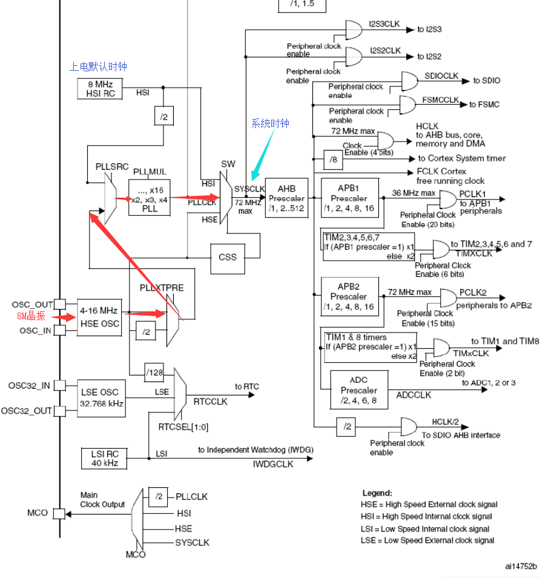
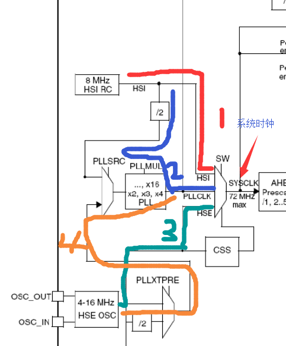

# 裸奔STM32 系统时钟 + NVICC

##认识时钟树
在配置系统时钟之前先观摩一下STM32时钟树。比起51的时钟配置，STM32的时钟配置看起来挺吓人--个屁。看懂之后，其实挺简单的。  
  
看图，我们比较关注的是系统时钟，当然使用M3也想要它效率最大嘛，你配置个8M时钟还不如用51单片机。那我们直接奔着72M去。  
首先根据时钟树我规划了5条路线，调调大路通罗马嘛。   
    

画的有点丑，将就将就。( ╯□╰ )
**路线1:**
HSI直接进来作为系统时钟。  
HSI是内部8M时钟，明显不够。PASS.   
**路线2:**
HSI 8M -> 2分频 4M -> PLLMULL 2-16倍频 max=64M   差点。PASS
**路线3:**
HSE OSC直接进来，HSE OSE是外部晶振时钟，晶振范围4-16M，也不够。   PASS   
**路线4:**
HSE OSC 外部晶振 4-16M进入 -> 是否/2 -> PLLMUL 2-16倍频   
要得到72M时钟，只有8*9=72；9可以从PLLMUL倍频得到，8可以从HSE OSE直接得到，或者16M / 2得到。嗯，路线规划完毕，老司机开车，准备出发咯。
